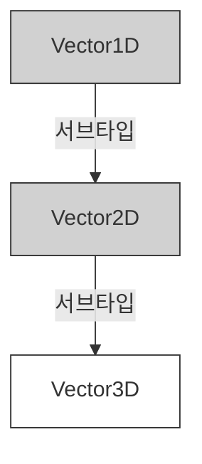
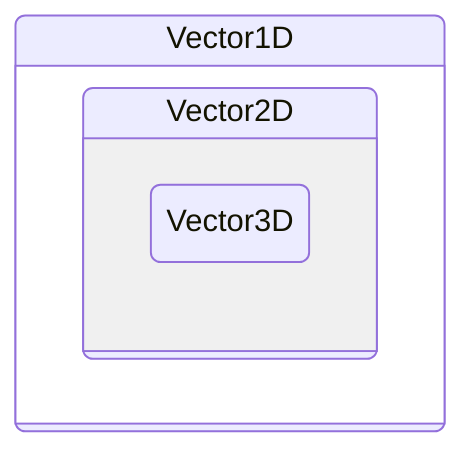

# 📂 [Week 2] Item 6~10: 타입 시스템의 기초

---

## 🏷️ Metadata

학습일: 2025년 12월 21일

주차: #Week1

키워드: #TypeScript #1주차 #집합론 #타입공간 #값공간 #타입단언

---

## 🚀 핵심 요약

> [!abstract] 이 섹션의 핵심 한 줄
>
> 편집기를 잘 이용하여 언어 서비스의 이득을 봐야햔다.
> 타입을 집합 개념으로 이해하고 타입 단언보단 타입 선언을 사용해야한다.
> 객체 레퍼 타입과 기본형 타입을 잘 구분해야한다.

---

## ✍️ 주요 내용 정리

### Item 6. 편집기를 이용해 타입 시스템 탐색하기

- 편집기의 언어 서비스를 적극 사용해야한다.
    - 자동완성, 마우스 클릭하면 타입추론 등
    - 타입 시스템의 동작 방식 dom.lib.ts,타입 스크립트의 타입 추론 방식을 알 수 있다.
    - 타입 선언 파일 (\*.d.ts) 을 참고할 수 있다.

### Item 7. 타입이 값의 집합이라고 생각하기

- 타입은 유한(boolean, 리터럴)하거나 무한(number, string..)하다.
- 타입은 집합으로 표현이 가능하다.
- A는 B를 상송 = A는 B의 서브타입
- A는 B에 할당 = A는 B의 부분집합
- excess property checking typescript :
- 타입 체커는 하나의 집합이 다른 집합의 부분 집합인지 확인한다.
- 타입들 (never, unit, literal, union)
    - never: 아무것도 들어갈 수 없는 타입 ( 공집합 )
    - unit, literal: 한 가지 값만 갖는 타입 ( a, b )
    - union: 두 가지 이상의 값을 갖는 타입 ( a | b )
- union(|) vs intersection(&)
    - 유니온 (union 합집합) = Persion | Lifespan
    - 인터넥션 (intersection 교집합) = Person & Lifespan

```typescript
interface Person { name: string;}
interface Lifespan { birth: Date; death?: Date;}
type MyTypeUnion = Person | Lifespan;
-- 각 속성이 공통으로 갖는 값이 없으므로 naver. name 만 있어도 되고, birth 만 있어도 됨

type MyTypeIntersection = Person & Lifespan;
-- 각 집합을 하나의 묶음으로 보고 타입이 정해짐. name 도 있어야 하고, birth 도 있어야 함
```

- keyof 는 조금 더 보는걸로

타입은 서브 타입(부분 집합)인 경우 할당할 수 있다.

- Vertor3D 는 Vertor2D의 서브타입이고 Vertor2D  는 Vertor1D 의 서브타입이다.
- 클래스 관점에서는 서브클래스가 된다.
- 42 페이지, 그림 2-7 표기 오류인 것 같다.





```typescript
interface Vertor1D {x: number}
interface Vertor2D extends Vertor1D {y: number}
interface Vertor3D extends Vertor2D {z: number}
```

### Item 8. 타입 공간과 값 공간의 심볼 구분하기

- 심벌(Symbol)은 타입 공간이나 값 공간에 동일한 키워드로 사용될 수 있음
    - const, let 과같은 영역에서 값 공간으로 쓰일 수 있다.
    - type, interface 와 같이 타입 공간에서 사용할 수 있다.
- 타입스크립트를 컴파일하여 자바스크립트가 나온다.
    - 제거가 되면 타입 공간이고, 제거가 안되면 값 공간이다.
- 타입 선언(:) 또는 단언문(as) = 타입 케스팅 다음에 다오는건 타입 공간이다.
- 클래스가
    - 타입으로 쓰이면 속성과 메서드가 사여용된다.
    - 값으로 쓰이면 생성자가 사용된다.
- typeof 는 값을 타입으로 사용할 때 쓰인다.
- 자바스크립트는 6개의 런타임 타입이 존재한다.
    - nunber, boolean, undefined, object, function

```typescript
const v = typeof Cylinder; // 값이 "function"
type T = typeof Cylinder; // 타입이 typeof Cylinder

```

- 값이 동일하더라도 타입이 다를 수 있다. `Array<string>, string[]..`
- 타입 속성을 얻을땐 `obj['field']` 를 사용해야한다.
- 자바스크립트의 this 키워드와 타입스크립트의 this 타입은 다르다.
    - 서브클래스의 메서드 체인을 구현할 때 사용된다.
- 순간 속을뻔

```ts
function email({to: Person, subject: string, body: string}) { /* ... */ }
```

- 모든 값은 타입을 가진다. 하지만 타입을 만들고 사용하지 않는다면 값을 가지지 않는다.
- class, enum 키워드는 타입과 값 두가지로 사용될 수 있다.
- typeof, this 등 연산자들은 타입공간과 값 공간에서 다르게 쓰일 수 있다.

### Item 9. 타입 단언보다는 타입 선언을 사용하기

- as Type 은 타입 단언, 타입 케스팅(as 키워드나 <> 문법을 사용)
- 타입 단언은 강제하는거고, 타입 선언은 인터페이스를 만족하는지 검사한다.
- 타입 단언은 타입 체커가 추론한 것보다 내 생각이 더 명확할 때 사용한다.
- 접두사 ! 는 boolean 의 부정문, 접미사 !는 null 이 아니라는 단언문으로 생각한다.
    - null 이 아닌걸 확신할 때 쓰이며, 그렇지 않는다면 if 문으로 검사를 해야한다.
- 모든 타입은 unknown 의 서브타입이다.
- 화살표 함수의 반환 타입을 명시하는 것이 중요하다.

### Item 10. 객체 래퍼 타입(String, Number, Boolean, Symbol, BigInt) 피하기

- 객체 이외애 기본형 값들에 대한 7가지 타입 (string, nuber, boolean, null, undefined, symbol, bigint)
    - bigint 는 왜 있는지 모르겠다. 개같다.
    - null, undefined 는 객체 래퍼가 없다.
- 기본형은 메서드를 가지지 않는다는 점에서 객체와 구분된다. (불편 = immutable)
- 자바스크립트의 string 동작방식
    - string 기본형에 charAt() 을 사용하면 기본형을 String 객체로 래핑하고 메서드를 호출하고 래핑을 버린다.
    - String.prototype 을 몽키-패치하면 내부 동작을 관찰할 수 있다.
    - 석사 마친 형이 Map 이나 Set 을 직접 구현해서 쓴다는데 이걸 말하나봄
- string 타입을 String 으로 작성하면 문제가 발생할 수 있다.
    - ['a', 'b'].includes(String 타입)
    - string 은 String 에 할당할 수 있지만, String 은 string 에 할당이 불가능하다.
    - 대부분 타입은 기본형 타입으로 되어있다.

---

## 💻 코드 예시

**❌ 지양해야 할 코드**

```typeScript

```

**✅ 지향해야 할 코드**

```typeScript


```
