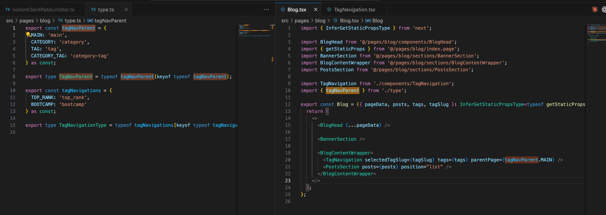
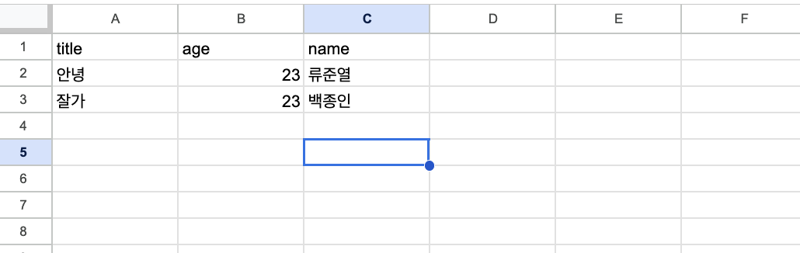
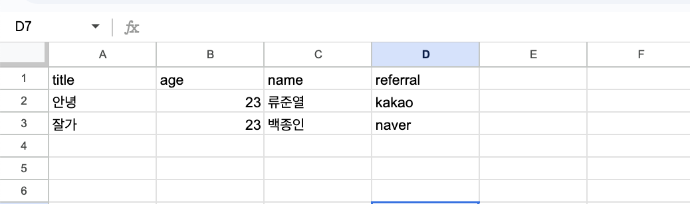

# Item 33-37

## Item 33: string 타입보다 더 구체적인 타입 사용하기

### string 보다 구체적인 타입

값이 정해져 있는 경우에는 string보다 구체적인 타입 사용하기

```ts
// Don't
// artist가 윤도현, 박정현, 임재범일때 string을 넣으면 이건 any와 다를바 없다.

interface Album {
  artist: string;
  title: string;
  releaseDate: "August 17th, 1959";
  recordingType: "Studio";
}
```

```ts
interface Album {
  artist: "윤도현" | "박정현" | "임재범";
  title: string;
  ..
}
```

#### Enum

- enum은 JS에 없는 개념이라 enum을 구현하기 위해 즉시 실행 함수를 만듬. 그리고 이 즉시 실행 함수는 타입이 아니라 런타임에 남아있게 되면서 찌꺼기 코드가 됨.(트리쉐이킹 되지 않음)
- as const나 유니온 타입으로도 충분히 Enum을 구현 할 수 있으므로 메모리 최적화 측면에서 Enum 사용을 추천하지 않음.

  > In modern TypeScript, you may not need an enum when an object with as const could suffice: [공식문서](https://www.typescriptlang.org/docs/handbook/enums.html#objects-vs-enums)

  

### keyof를 이용한 객체 속성 체크

만약 특정 객체의 key들을 넣어야 한다면 `keyof` 이용

```ts
const songs = {
  title: "Song List",
  tracks: [
    { id: 1, name: "Song A", duration: 210 },
    { id: 2, name: "Song B", duration: 180 },
    { id: 3, name: "Song C", duration: 240 },
  ],
  singer: "John Doe",
};

// Don't
const consolelogSongs = (param: string) => {
  console.log(songs[param]);
};

type SongsType = typeof songs;
type KeySongs = keyof SongsType; // 'title' | 'tracks' | 'singer'
const consolelogSongs = (param: KeySongs) => {
  console.log(songs[param]);
};
```

- 제너릭 이용

```ts
const songs = [
  {
    title: "Song List",
    tracks: [
      { id: 1, name: "Song A", duration: 210 },
      { id: 2, name: "Song B", duration: 180 },
      { id: 3, name: "Song C", duration: 240 },
    ],
    singer: "John Doe",
  },
];

function pluck<T>(records: T[], key: keyof T) {
  return records.map((r) => r[key]);
}

const songs2 = pluck<Song>(songs, "title");
```

## Item 34: 부정확한 타입보다는 미완성 타입 사용

- 타입을 정교하게 만들려다가 잘못된 타입을 만들면 그건 any보다 해롭다. 그래서 정확히 모델링 못하겠으면, 과하게 단정하지 말고 조금 넓은 타입으로 두고, 사용 지점에서 좁히는 게 낫다.

### 예시: 무한 생성이 가능한 Excel의 column

- 서버개발자는 column이 title,age,name만 있을것이라 생각하고 Response Type을 강제했다.

  

  ```ts
  export type ExcelColumn = {
    title: string;
    age: number;
    name: string;
  };
  ```

- 그런데 마케터가 referral 을 추가했다. 하지만 엑셀 `ExcelColumn`에는 title, age, name 밖에 없기 때문에 as any를 사용 할 수 밖에 없음

  

  ```ts
  import type { ExcelColumn } from "./server/types";

  function render(row: ExcelColumn) {
    // Property 'referral' does not exist...
    // 결국 팀은 아래 같은 짓을 하게 됨:
    const referral = (row as any).referral; // 컴파일 통과하지만 타입 신뢰 X
    return referral ? `추천인: ${referral}` : "추천인 없음";
  }
  ```

- 이럴바에는 열어두고 프론트(사용처)에서 관리하도록 하는게 낫다.

  ```ts
  export type ExcelRow = Record<string, unknown>;
  ```

  ```ts
  const SUPPORTED_COLUMNS = ["title", "age", "name", "referral"] as const;
  type SupportedColumn = (typeof SUPPORTED_COLUMNS)[number];

  function render(row: ExcelRow, key: SupportedColumn) {
    return row[key] || "";
  }
  ```

## Item 35: 데이터가 아닌, API와 명세를 보고 타입 만들기

**데이터에서 타입을 대충 역추론하지 말고, API, 스키마 명세를 기준으로 타입을 생성해라**

- 정상 데이터에서는 누락 필드, 옵셔널, 에러 응답 등 예외 케이스를 확인하기 어렵다.
- 그 결과 타입을 맞는 것 처럼 보이는데, 실제 운영 환경에서 깨질 수 있음.
- 책에 있는 예시코드는 위 내용을 이해시키기 위한 코드들

-> 실무적용 예시: OpenAPI/Swagger, GraphQL(스키마, 퀴리로 응답 타입 생성)
=> codegen을 빌드, CI에 넣으면 백엔드와 프론트의 스키마가 다를때 배포되지 않음 -> 안전한 코드가 전달되는 것을 보장 할 수 있음

## Item 36: 해당 분야의 용어로 타입 이름 짓기

### 이미 존재하는 도메인 용어 사용하기

- 자체적으로 용어를 만들지 말고, 협업자들 혹은 이미 널리 쓰이는 용어를 사용하기
- 제 경험: 교육회사에서 운영팀은 코스를 '교육과정 전체'라는 뜻으로 이해하고 코드 내의 Course는 교육과정 내의 작은 코스들을 뜻하고 있었음 -> 운영팀과 제품팀의 용어 통일이 되지 않아 소통 오류 빈번

- DDD의 유비쿼터스 언어와도 일맥상통
  - 기획, 도메인 전문가(ex운영팀), 개발자가 같은 단어로 같은 개념을 말해야 소통 비용과 오해가 없다.
  - 타입이 곧 설계 문서 역할을 하는 TS에서는, 유비쿼터스 언어 효과가 더 잘 나타난다. User, Account, Member 같은 단어가 섞이면 타입 레벨에서 혼란이 누적되는데, 도메인 용어를 고정하면 모델 경계가 선명해질 수 있다.

### 이름 잘 짓기

- 범용단어 피하기: data, info, item 같은 의미 없는 말 쓰지 않기
- 같은 개념은 같은 용어를 쓰기: userId, memeberId 등 섞어 쓰면 다른 개념인가? 라는 혼란이 생긴다.
  - 제 경험: 서버에서 내려준 데이터를 프론트에서 다른 네이밍으로 만들어 버리면 혼란이 누적되는 경험을 했음. 그래서 서버에서 내려준 용어를 그대로 프론트에서 사용하는 편.
    백엔드 개발자가 데이터 설계시 도메인 용어를 고려하고 백엔드에서 내려준 네이밍을 프론트에서 그대로 사용하면 프론트,백엔드, 기획자간의 용어 통일이 수월해짐

## Item 37: 공식 명칭에는 상표 붙히기

### 태그기법

런타임과 TS의 간극을 줄이는데 사용할 수 있는 스킬중 하나.

키오스크를 만들어야 하는 상황에서 옵션의 종류가 3가지가 있었음.


> 그리드 옵션은 컬럼수가 필요하고, 리스트 옵션은 최소 선택 개수, 최대 선택 개수가 내려온다.

```ts
interface BaseOption {
  id: number;
  name: string;
  labels: string[];
}

type Tag = "grid" | "select" | "list";

export interface GridOption extends BaseOption {
  tag: "grid";
  col: number;
  icons: string[];
}

export interface SelectOption extends BaseOption {
  tag: "select";
  prices: number[];
}

export interface ListOption extends BaseOption {
  tag: "list";
  maxCount: number;
  minCount: number;
  prices: number[];
}

export type OptionResponse = GridOption | SelectOption | ListOption; // 태그된 유니온

// Do Not

// matchedOption: OptionResponse | undefined
if (matchedOption) {
  // GridOption에 prices가 없다는 내용과 타입충돌을 방지하기 위해 as를 사용할 경우 오로지 개발자의 능력에 의존한다.
  const price = (matchedOption as ListOption).prices[selectedIndex];
}

// Do
function isListOption(option: OptionResponse): option is ListOption {
  return option.tag === "list";
}

if (matchedOption && isListOption(matchedOption)) {
  const price = matchedOption.prices[selectedIndex];
}
```

태그기법을 통해 런타임 동작이 아니라 실제 데이터 타입에 근거한 타입 검증가능
